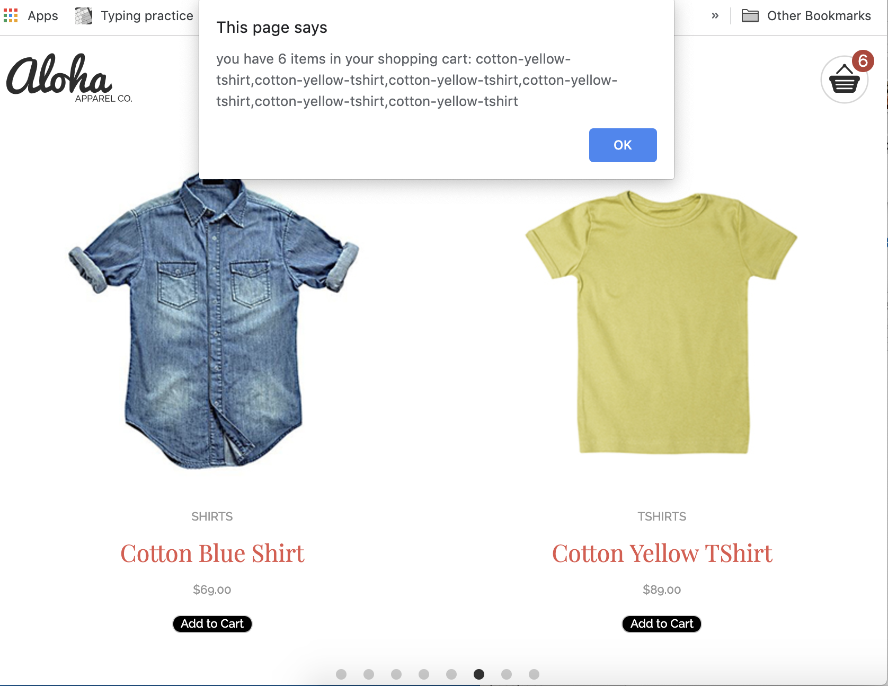
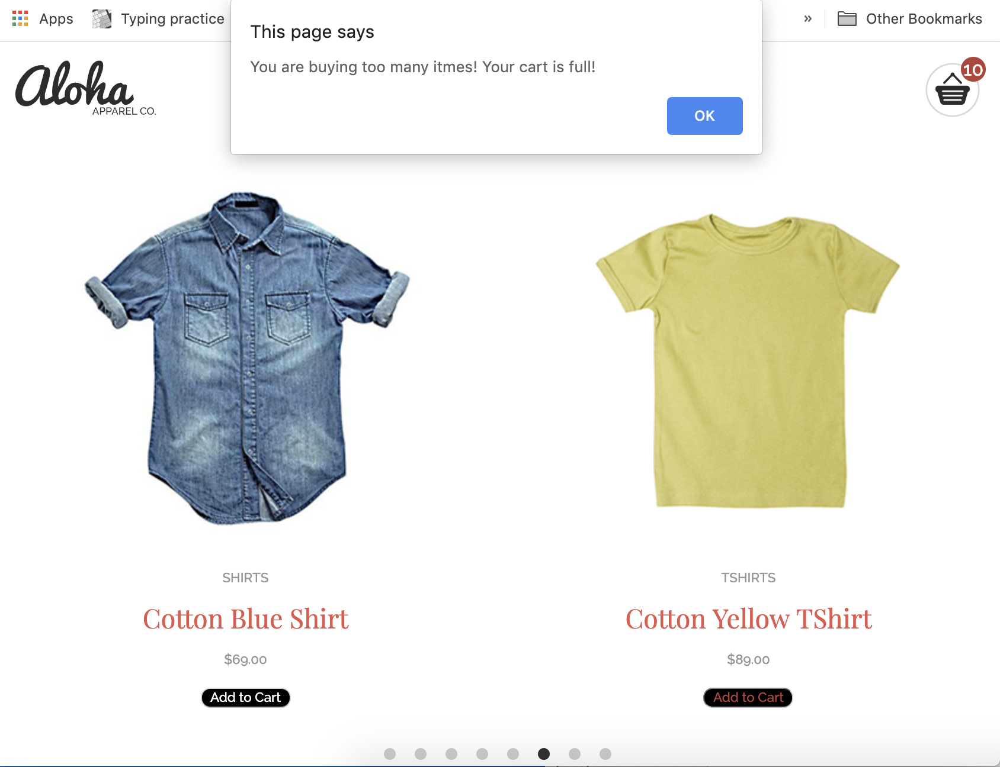
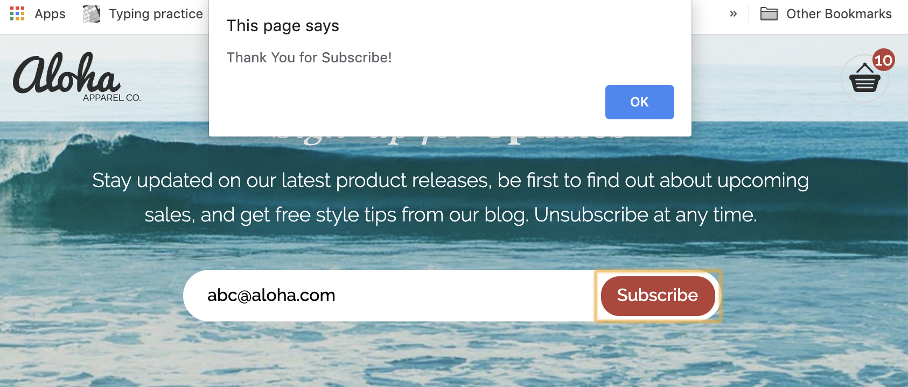
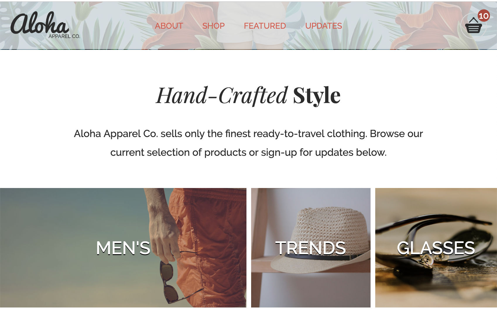

# Aloha Project 1
Aloha project is the homepage of a Hand-crafted style apparel company.

# Motivation
Aloha project is the first webpage that I have ever done. It took me about 2 weeks studing from the foundamental basic of HTML to finished this project. and it is my first step to become a full-stack deveploper.

# Things Learned
I have learned a lot during these two weeks:
## 1. HTML
- Structure of HTML, HTML 5: Use Semantic Code; 
- Meta Tags, Headings, Lists, Divs, links, Images, Forms, Buttons;
    ```
        <html>
            <head>
                <meta charset="UTF-8" />
                <meta name="viewport" content="width=device-width, initial-scale=1" />
            </head>
            <body>
                <header>
                    <h1>...</h1>
                </header>
                <article>
                    <p>...</p>
                </article>
                <article>
                    <a>...</a>
                </article>
                <footer>
                    <p>...</p>
                </footer>
            </body>
        </html>
    ```
## 2. CSS
- Box Model and Block vs. Inline Elements
- Classes and IDs
- Specificity
- Color and backgrounds
- Web Font
- CSS "Resets" and "Normalize
- Responsive Webdesign
    ```
        /*  Mobile First */
        @media screen and (max-width: 600px) {
            /* Table */
        }
        @media screen and (max-width: 1240px) {
            /* Desktop Screen Size */
        }
    ```
- FlexBox
    ```
        .container {
            align-items: center;
            display: flex;
            height: 300px;
            justify-content: center;
        }
    ```
## JavaScript
- JavaScript Basics
- Using JavaScript on the Web
- Operators and Control Flow
- Functions
- The DOM and Event Listeners
- Array basics
- Use loops to iterate arrays
- Modify arrays with built-in methods
## Tools
- Editor: Visual Studio Code;
- Developer Tools;
- Console;
- CodePen;
- Tools for Font: ColorZilla, Font Awesome, google font;
- Normalize.css; autoPrefixer;
- Markup validations;
- Git and GitHub;
- Command Line Interface;

# Features and ScreenShots
### 1. Flex Box Example

### 2. Update the cart icon in the top-right corner of the header every time the user clicks the “Add to Cart” button for a product and alart message pop-up with item list when click cart icon

### 3. Show Cart Full Message when cart has 10 items

### 4. Show Thank you for Subscribe Message when subscribe and pass email validation

### 5. Incorporate a fixed header at the top of the page so that the navigation menu is always visible when the user scrolls down the page and fixed problems of header overlapping contents


# Language used
    Language used: Javascript.

# Plug-in usage
### 1. FLICKITY (in JavaScripts): https://flickity.metafizzy.co/
- for the slider showing the most liked products.   
### 2. AutoPrefixer: https://autoprefixer.github.io/
- parse CSS add vendor prefixes for cross browser experience.
### 3. Normalize.css: http://necolas.github.io/normalize.css/
- makes browsers render all elements more consistenely.
### 4. Font Awesome: https://fontawesome.com/start
- for icon font

# How to use?
    Open index.html by any browser.
